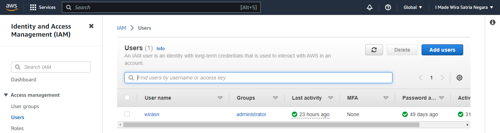
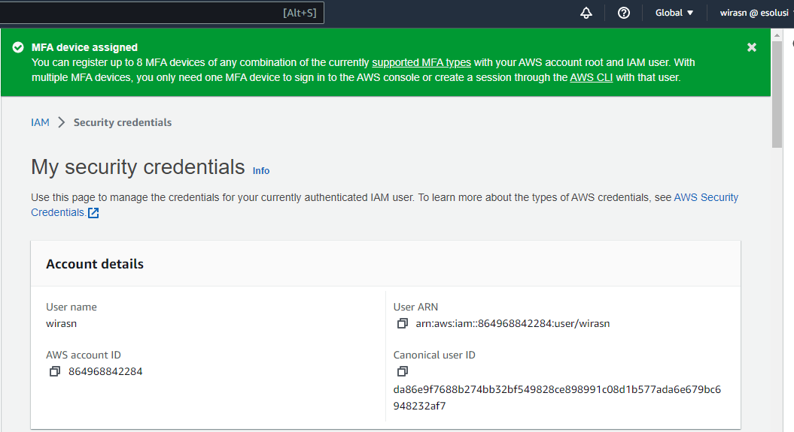
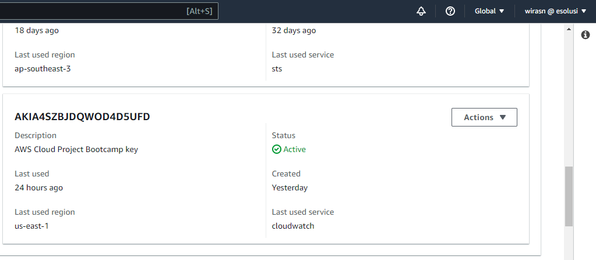
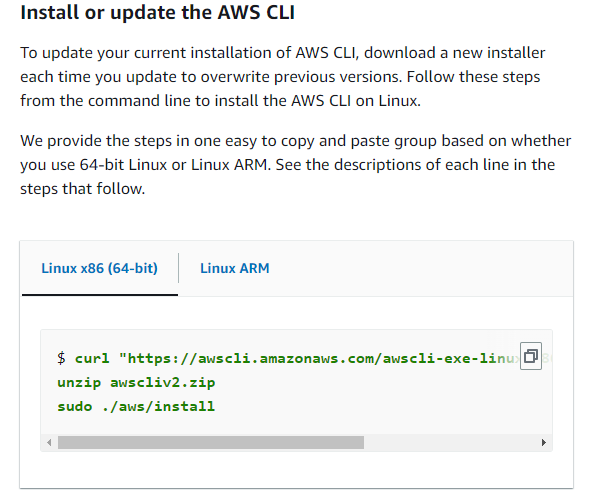
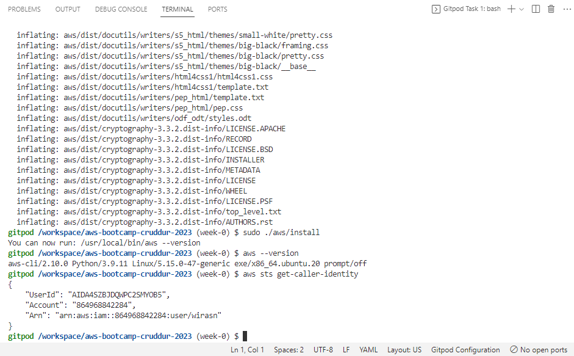
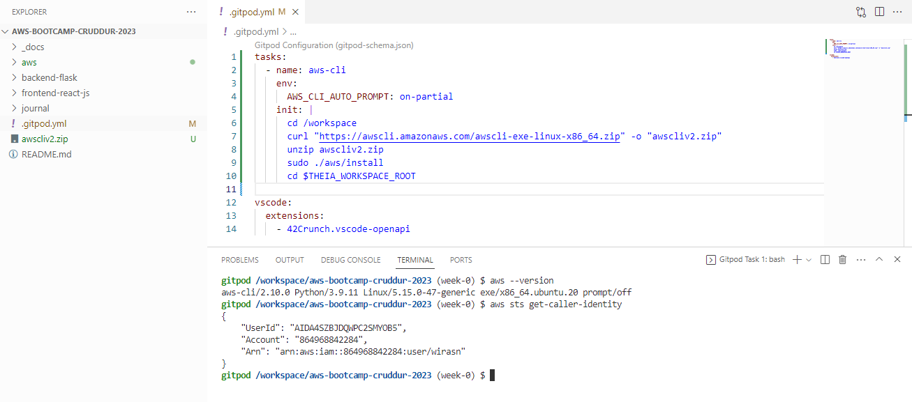
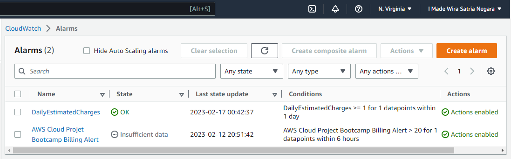
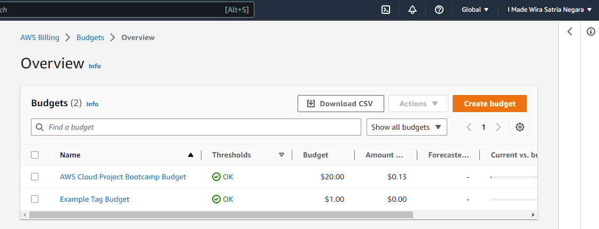
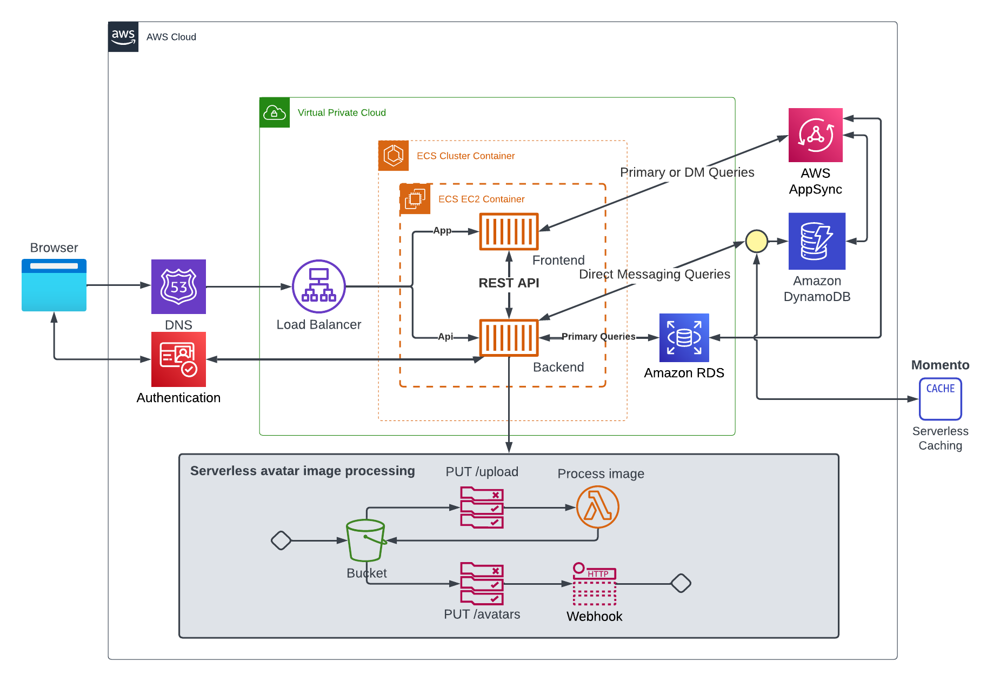

# Week 0 — Billing and Architecture

## Technical Task Todo

### Create an Admin user dan test to access this account

I logged in using the AWS free-tier root account I created earlier. Following [security considerations **Ashish Rajan**](https://www.youtube.com/watch?v=4EMWBYVggQI&list=PLBfufR7vyJJ7k25byhRXJldB5AiwgNnWv&index=15) :
  1. Enable MFA for root user using google authenticator
  2. I have created an IAM user before, so I use this user as an admin user

   
  
  4. Logout from the root user and login using the admin user
  5. Enable MFA for admin user

  
  
### Generate AWS Credential

I added new AWS credential for use on this bootcamp

  
  

### Install AWS CLI

I installing AWS CLI on Gitpod. First, point to my repo on Github, then click the Gitpod button.
Create new Terminal with bash prompt, go to the week-0 branch.
Refer to [AWS CLI User Guide](https://docs.aws.amazon.com/cli/latest/userguide/getting-started-install.html), I follow these steps from the command line to install the AWS CLI :

  
  
AWS CLI installed succesfully !
And then set Enviroment Variable below dan fill in using AWS admin credential i generate before.

```
export AWS_ACCESS_KEY_ID=""
export AWS_SECRET_ACCESS_KEY=""
export AWS_DEFAULT_REGION=us-east-1
```

  
  
After manually install succeed, I update .gitpod.yml file :
  1.  To install the AWS CLI when our Gitpod enviroment launch
  2.  Set AWS CLI to use partial autoprompt mode to make it easier to debug CLI commands
  
We'll tell Gitpod to remember the credentials whenever relaunch workspace

```
gp env AWS_ACCESS_KEY_ID=""
gp env AWS_SECRET_ACCESS_KEY=""
gp env AWS_DEFAULT_REGION=us-east-1
```

### Check that the AWS CLI is working whenever relaunch workspace

Make sure Gitpod remember the credential



### Create a Billing Alarm

I created 2 billing alarm :
  1. **Using billing console**, click on Billing preferences -> tick on Receive Billing Alert, then save preference.
     Click on Manage Billing alerts link, then follow [Chirag Nayyar explaination](https://www.youtube.com/watch?v=OVw3RrlP-sI&list=PLBfufR7vyJJ7k25byhRXJldB5AiwgNnWv&index=14) to setup cloudwatch alarm. Here I set USD 20 as threshold value.
  2. **Using AWS CLI**
     First, make SNS Topic, then create subscription of the Topic. I set dan create Cloudwatch alarm using config file in JSON format.
     Here I set USD 1 as a threshold value.
     
  It look like not match for threshold. Just for learning purpose LOL
     
  
  
  
 ### Create an AWS Budget

I created 2 budget :
  1. **Using billing console**, click on Budget, then create budget.
     I follow [Chirag Nayyar explaination](https://www.youtube.com/watch?v=OVw3RrlP-sI&list=PLBfufR7vyJJ7k25byhRXJldB5AiwgNnWv&index=14) to setup an AWS budget for USD 20
  2. **Using AWS CLI**
     Get AWS Account ID
      ```sh
      aws sts get-caller-identity --query Account --output text
      ```
     Update the JSON files with the AWS Account ID, then replace Account ID on script below before running this CLI command
     
      ```sh
      aws budgets create-budget \
          --account-id AccountID \
          --budget file://aws/json/budget.json \
          --notifications-with-subscribers file://aws/json/budget-notifications-with-subscribers.json
      ```
      Below my AWS Budget overview
      
      
      
    ### Cruddur Logical Architectural Diagram
    
    I never using Lucid chart before, so learning by doing and takes time.
    Here my diagram i created, need more time to add or replace momento icon :)
    
      


  
  
  
  
  


 


