# Week 1 — App Containerization

## Containerize Backend 

### Test it running on local environment

Before containerize, i'll make sure the backend app running on local environment without errors.
First, typing below commands to install the flask modules

```sh
  cd backend-flask
  pip3 install -r requirements.txt
```

Set this two Environment Variable

```sh
  export FRONTEND_URL='*'
  export BACKEND_URL='*'
```

Then running an app on port 4567

```sh
  python3 -m flask run --host=0.0.0.0 --port=4567
```
After running, click the PORT tab, click the address link which port is 4567 and append this endpoint : /api/activities/home

When succesfull, there will be json output on browser screen

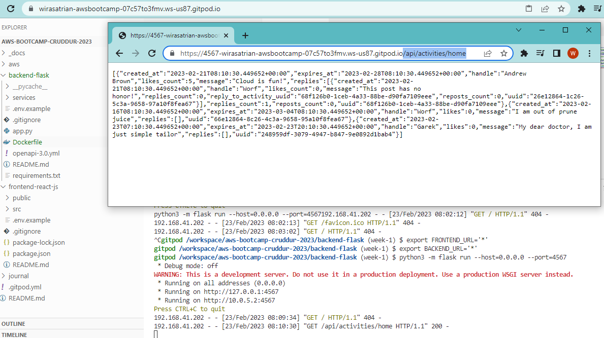


### Create Dockerfile

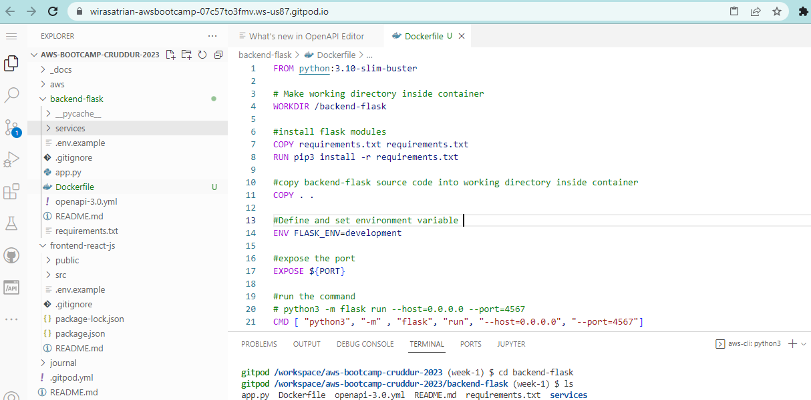


### Build Docker Image

The next step was build docker image from a Dockerfile, give it backend-flask with default latest tag

```sh
  docker build -t backend-flask .
```
Check the resulting image by typing this command

```sh
  docker images
```
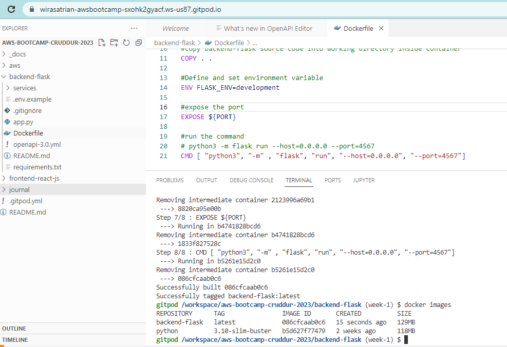

### Run Container

Run container using image that was created before using these option :
```
  -p 5000:4567  => binding host port 5000 into container port 4567
  -name         => name the container a given name
  -d            => run container in background and print container ID (detach mode)
```
```sh
  docker run -p 5000:4567 -d --name backend-flask backend-flask
```
Cek and list the running container by this command

  ```sh
    docker ps
  ```
  
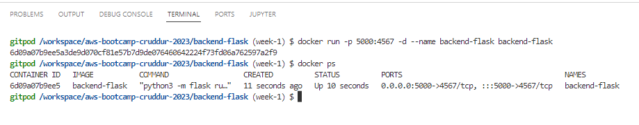
  
Try to test the running container using curl :

```
  curl -X GET http://localhost:5000/api/activities/home -H "Accept: application/json" -H "Content-Type: application/json"
```

Ooppss! Type Error on terminal screen. 

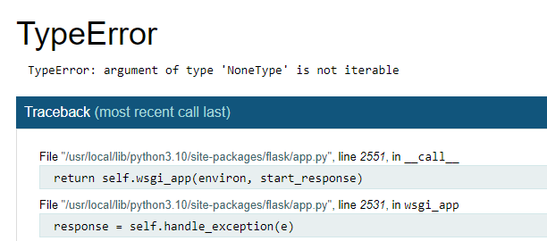


Show the logs using docker logs command

```
  docker logs backend-flask
```

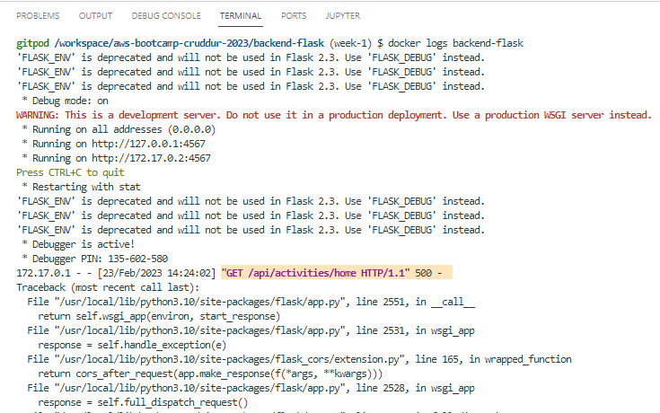


The environment variable seems not set yet. Try to debug using docker exec command and check the environment variables.

```
  docker exec -it backend-flask bash
```
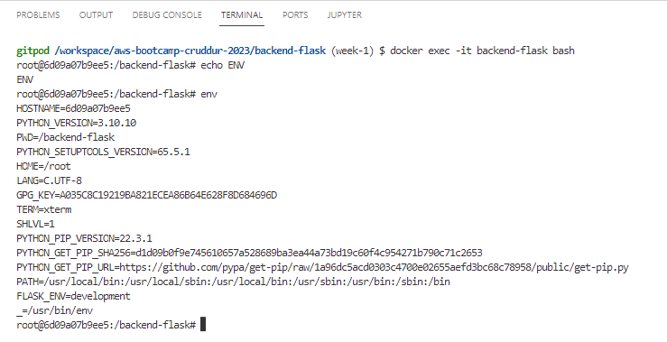


Stop and remove the container, re-run the command with additional option -e to set enviroment variables 

```sh
  docker stop backend-flask
  docker rm backend-flask
  docker run -p 5000:4567 -d --name backend-flask -e FRONTEND_URL='*' -e BACKEND_URL='*'  backend-flask
```
Then test again. Success !

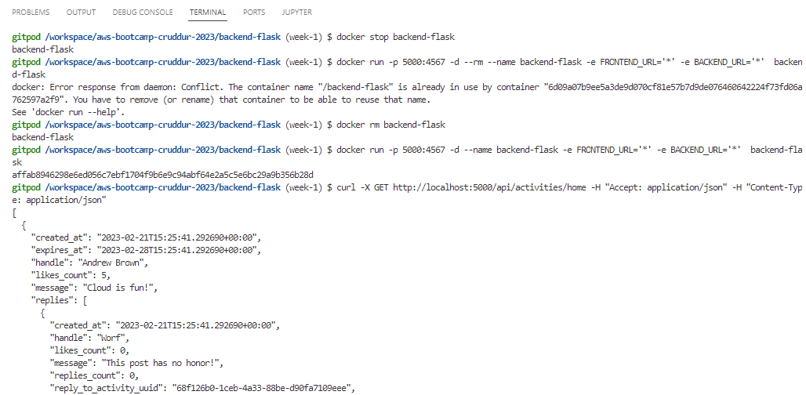


## Containerize Frontend 

### Create Dockerfile

Change directory to frontend-react-js and create Dockerfile

```
  cd frontend-react-js
  touch Dockerfile
```

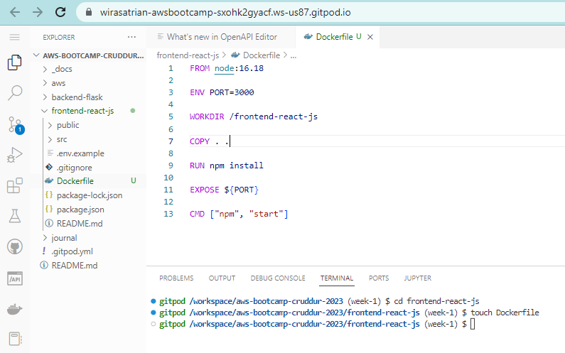


### Build Docker Image

Build docker image from a Dockerfile, give it frontend-react-js with default latest tag

```sh
  docker build -t frontend-react-js .
```

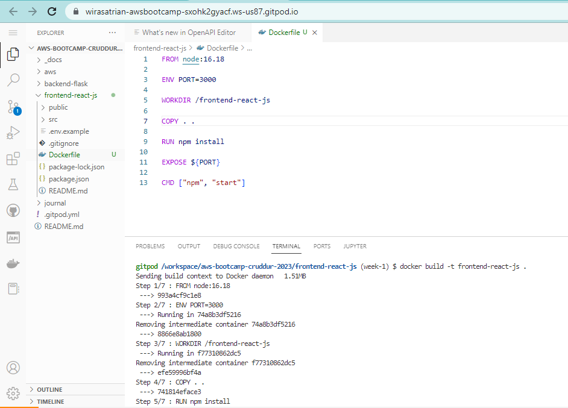


Check the resulting image by typing this command

```sh
  docker images
```
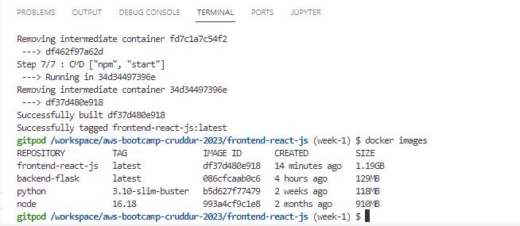


### Run Container

```sh
  docker run -p 6000:3000 -d --name frontend-react-js frontend-react-js
```
Cek and list the running container by this command

  ```sh
    docker ps
  ```
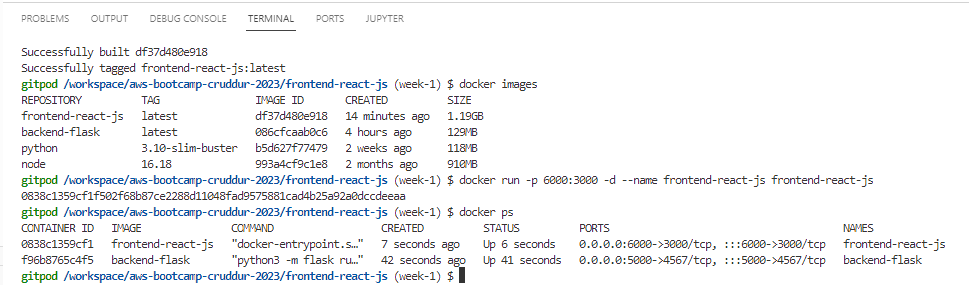


Test the running frontend container, click the PORT tab on terminal, click the address link which port is 6000

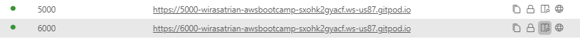


Output show on browser

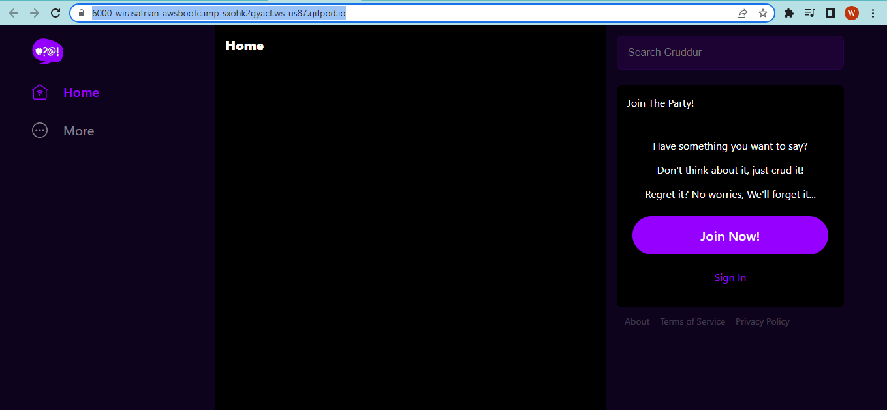


## Multiple Containers

Here I would build and running backend and frontend containers using **docker-compose**

### Run NPM Install

We have to run **npm install** in order to downloads a package and it's dependencies before building the container

```
  cd frontend-react-js
  npm install
```

### Create a docker-compose file

Go back to the root directory of the project workspace from frontend-react-js directory, create docker-compose.yml

```
  cd ..
  touch docker-compose.yml
```
As the the same with what i am doing before on the containerize Backend and Frontend, I binding the host port 5000 to backend container port 4567 and bind the host port 6000 to frontend container port 3000

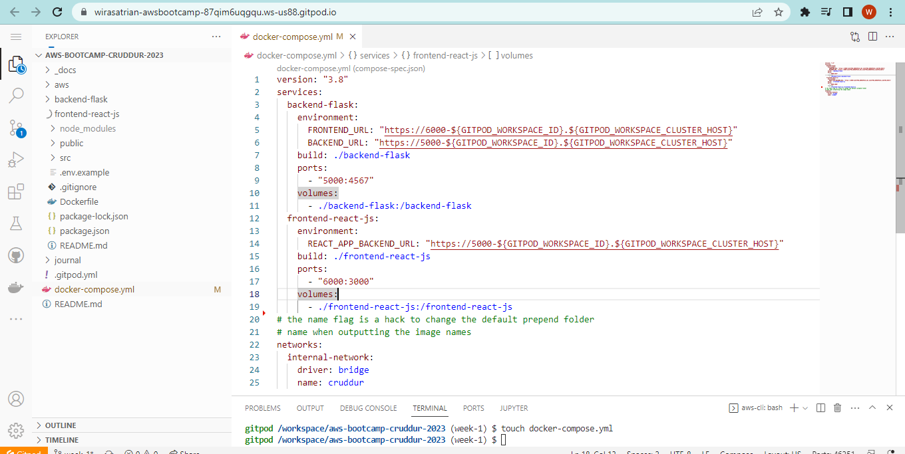

### Run docker-compose

```
  docker compose -f docker-compose.yml up
```
When successfull, backend container, frontend container and network was created

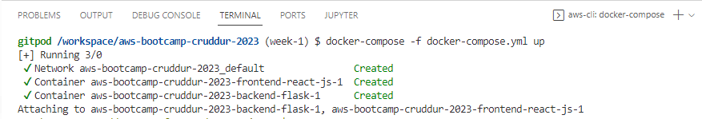


Click on PORTS tab, URL Address and port would look like below :

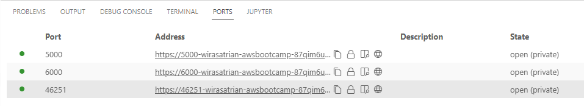


### Testing

Click the frontend URL, the frontend page appear but seem the data from backend not load. 

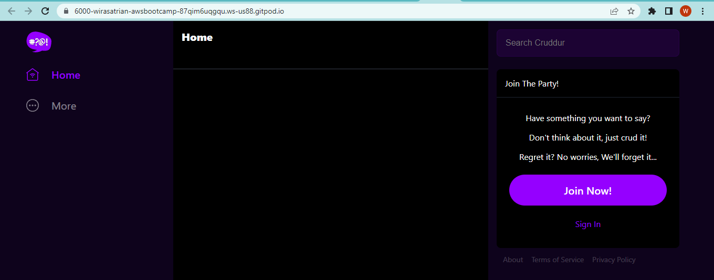


#### Inspecting 

I inspect backend and frontend container to check if the environment variable are set correctly. 

I clicked the docker tab on left side VSCode web, then right click backend container, click on inspect and check the port bindings and env list. I found they were set correctly.

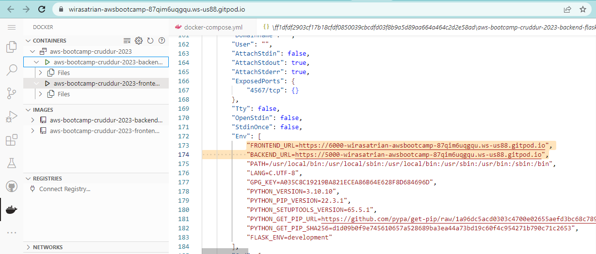


Right click frontend container, click on inspect and check the port bindings and env list. I found they were set correctly.

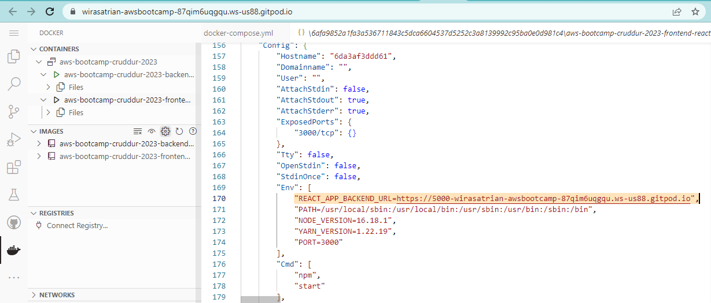


Then I inspect the web page, and found CORS issue and a 401 Unauthorized error.

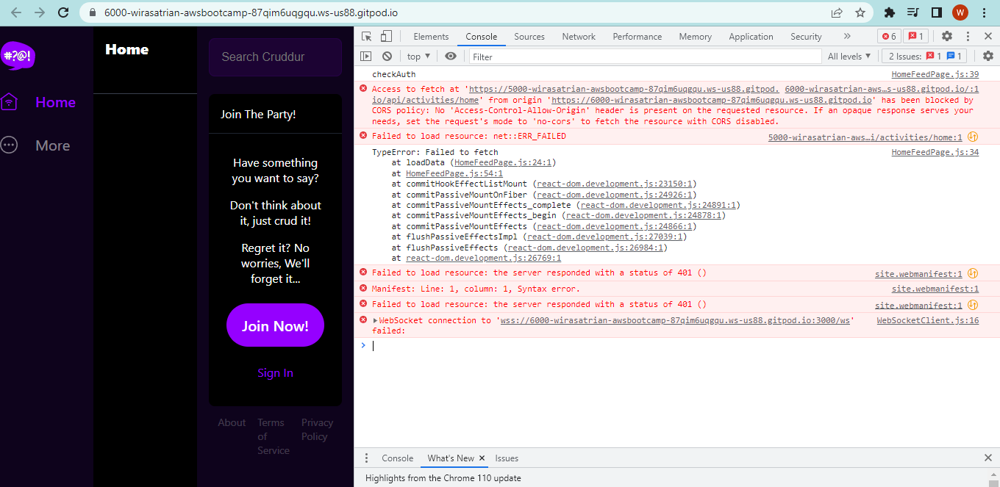


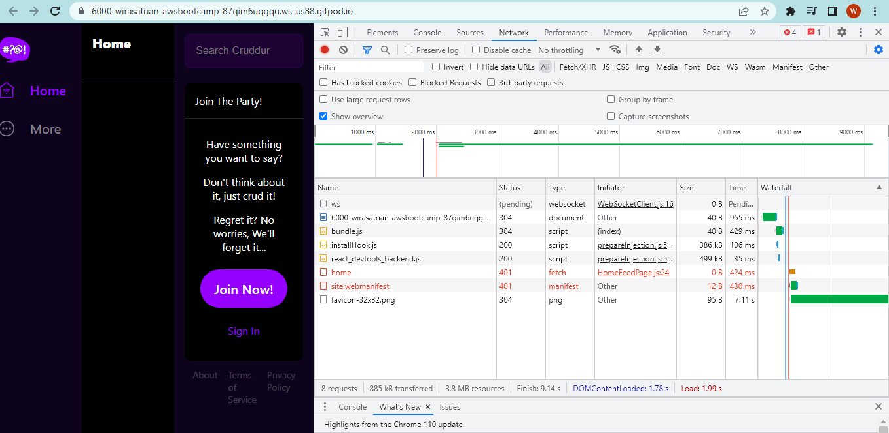


After trying any references on the same issue on discord like change the origin into anywhere, insert @cross_origin() to any route on file app.py, etc ... **I resolve the issue by make the backend to be public**

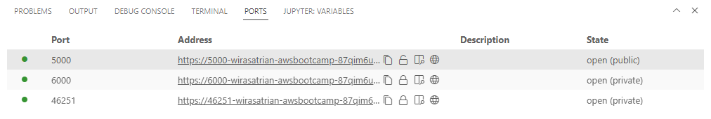

After re-test, frontend and backend worked each other

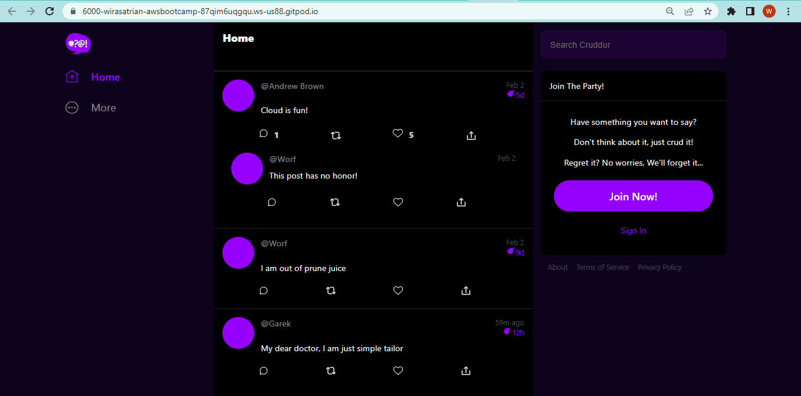


## Notifications

I would add notifications endpoint on backend and notification page on frontend.

### Backend Notification Endpoint

  1. Create function that return JSON list on NotificationsActivities class, save as notifications_activities.py inside services folder

      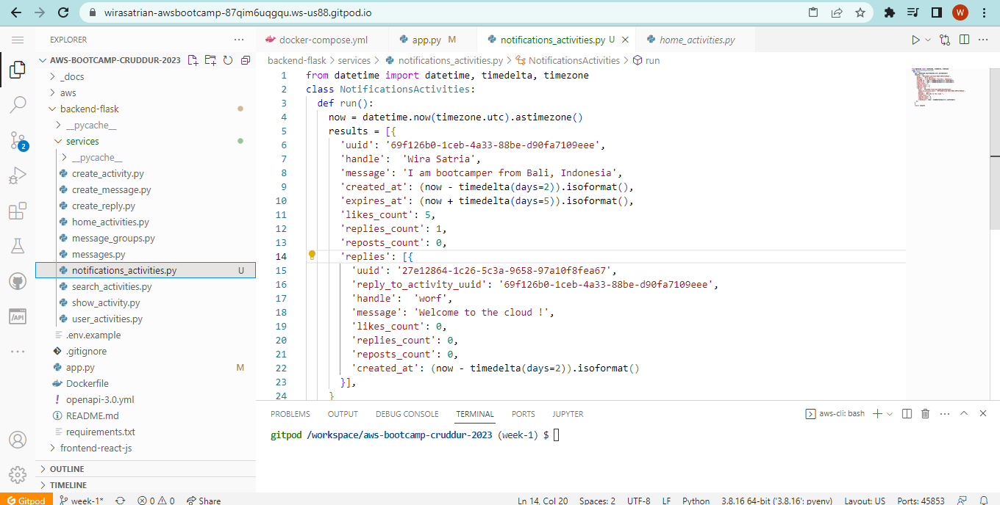

  2. Open app.py file on backend-flask folder, Import all module from services.notifications_activities and /
     create API endpoint /api/activities/notifications to return the result

      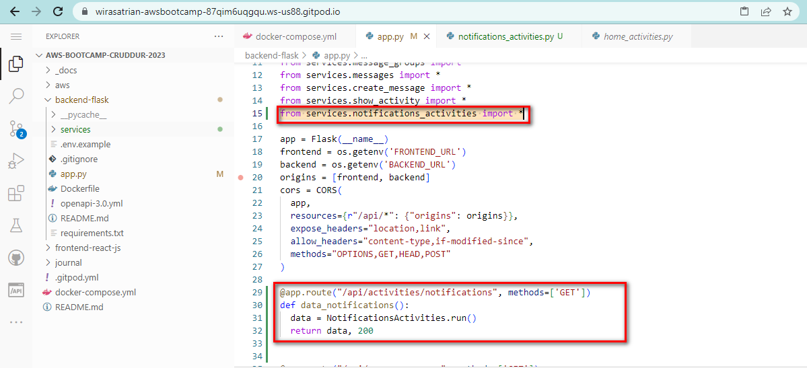
      
      
#### Test Notification API Endpoint

I build and running backend container, click the Backend URL addresss, append /api/activities/notifications, enter or reload the page and got the result as expected.

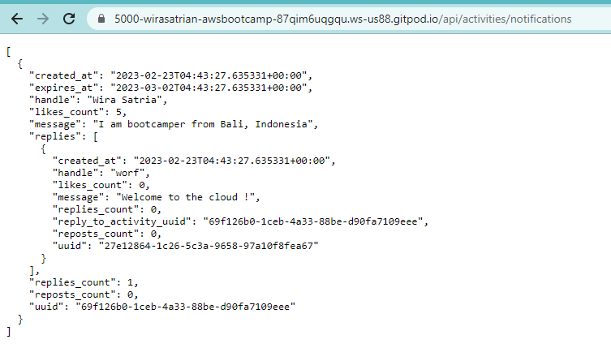


### Frontend Notifications Page

  1. I create Notification page with this steps :
      - Go to frontend-react-js/src/pages directory
      - Copy HomeFeedPage.js and rename to be NotificationPage.js
      - Copy HomeFeedPage.css and rename to be NotificationPage.css
      - edit NotificationPage.js, importing NotificationPage.css, change function name, change backend_url with API endpoint i created before, change title page

      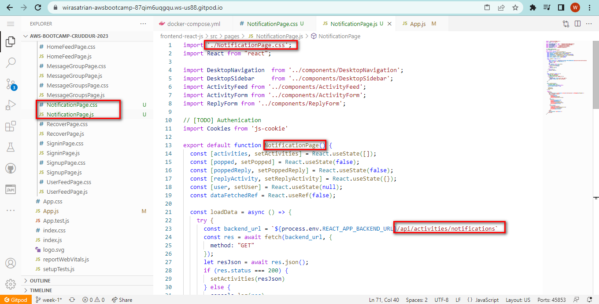

  2. I opened the app.js file, import NotificationPage and add route /notifications to NotificationPage

      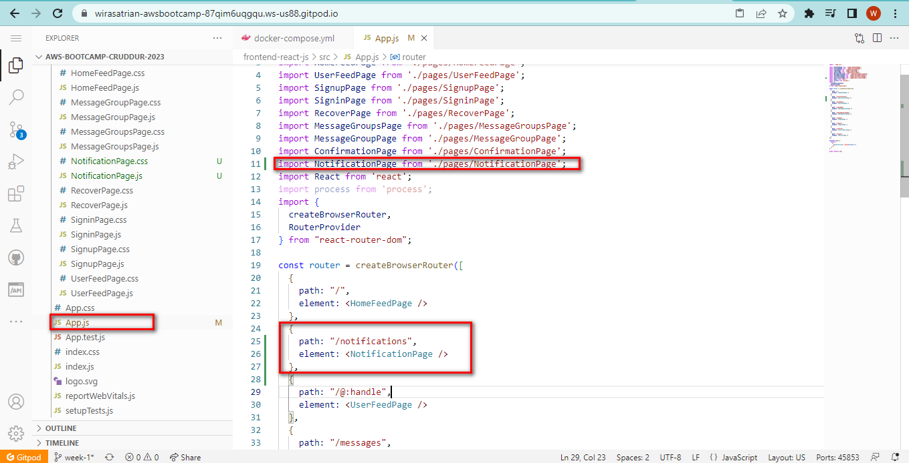
      
      
#### Test Notifications Page

I am running docker compose, click the Frontend URL addresss, Login into Cruddur, and click Notifications on left side bar

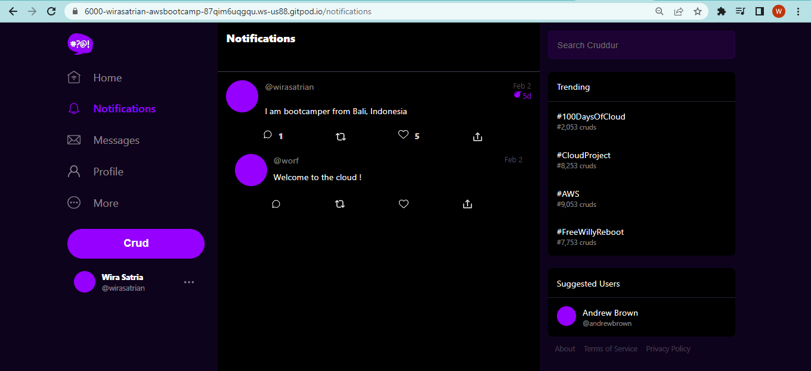


  
  

  
  
  


