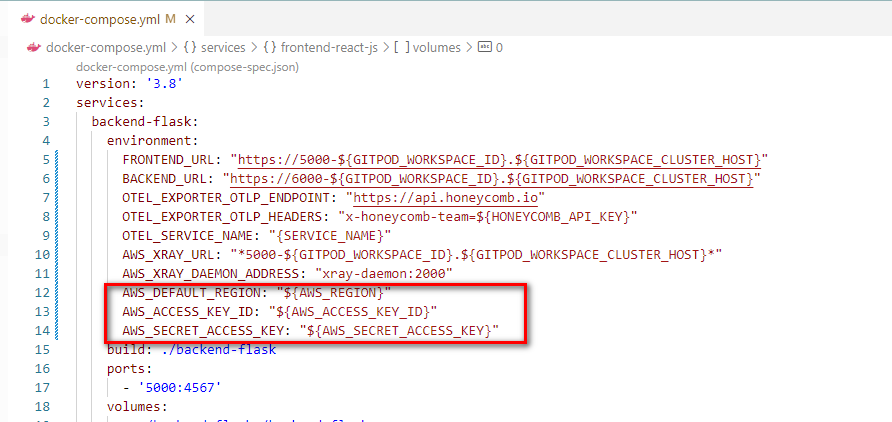
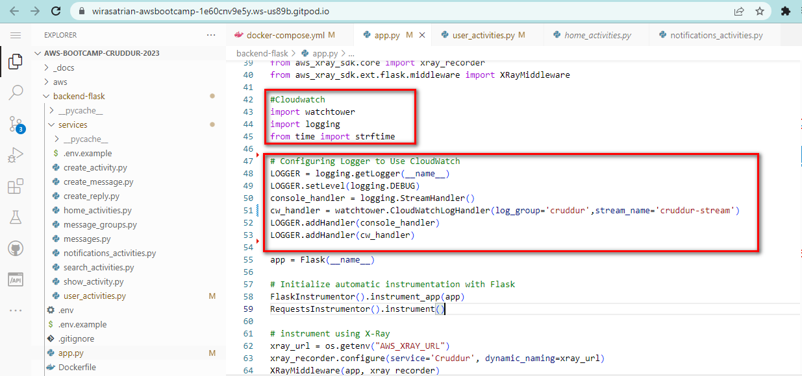
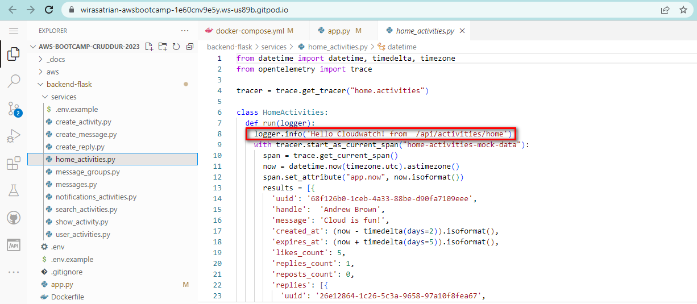
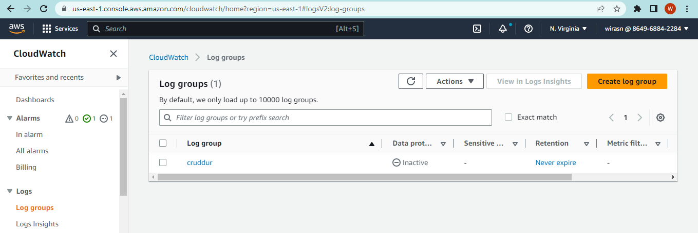
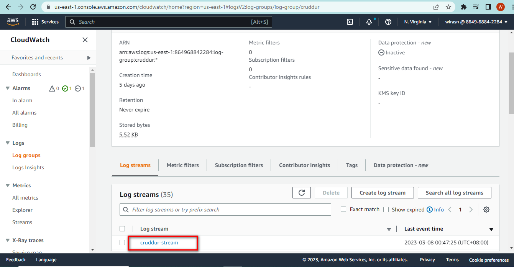
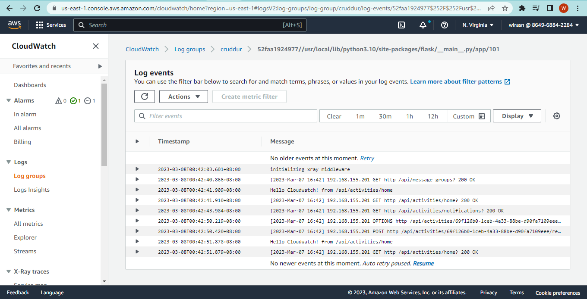

# Week 2 — Observability

The definition of **observability** is a measure of how well the internal state of a system can be understood by examining its external output.
Observability addresses this challenge of understanding by providing tools and techniques for collecting and analyzing data from the system, such as logs, metrics, and traces which also known as 3 pillars of observability.  

But how will you generate outputs to measure a system? You will need to write additional code to expose its inner state and observe it. This process is called **Instrumentation**. Instrumentation is the code we write to measure different metrics like response times, etc.

**Telemetry** is the process of collecting and transmitting data from remote or inaccessible sources to monitoring and analysis. It encompasses instrumenting the system under observation and sending the data to a visualization tool. 

In this week :
  - I learned instrument backend flask application, collecting and transmitting telemetry data using Open Telemetry (OTEL), then explore and observe traces within [Honeycomb](honeycomb.io). I also create a custom span and add custom attribute on create message endpoint to record userid, message and time created then querying 
  - I learned instrument backend flask application, collecting anda transmitting telemetry data using AWS-Xray daemon, then explore and observe traces within AWS X-Ray Console. I create subsegment instrumentation on home endpoint backend flask application, put annotation and metadata on that subsegment, query the trace and open up the trace detail and rawdata to ensure the subsegment was created successfully.
  - I write a custom logger to send application log data to CloudWatch Log group
  - I trying error logging and monitoring using [Rollbar](rollbar.com)


## Observability using Open Telemetry (OTEL) and Honeycomb

### Create Honeycomb Account

I follow [Gifted Lane Youtube Video](https://www.youtube.com/watch?v=7IwtVLfSD0o&list=PLBfufR7vyJJ7k25byhRXJldB5AiwgNnWv&index=10) to create [Honeycomb](honeycomb.io).
Login into honeycomb.io, then i create enviroment named `AWS Cloud Project Bootcamp', look up the API KEY. 


Execute this command to store and set the Honeycomb's API KEY on gitpod. Change `xxxxxxxxxxxx` with the API KEY.

```
export HONEYCOMB_API_KEY="xxxxxxxxxxxx"
export HONEYCOMB_SERVICE_NAME="Cruddur"
gp env HONEYCOMB_API_KEY="xxxxxxxxxxxx"
gp env HONEYCOMB_SERVICE_NAME="Cruddur"
```

### Install Open Telemetry Python Libray

I add the following library to `requirements.txt` file:

```
opentelemetry-api 
opentelemetry-sdk 
opentelemetry-exporter-otlp-proto-http 
opentelemetry-instrumentation-flask 
opentelemetry-instrumentation-requests
```

Then I install those libraries and dependencies:

```
cd backend-flask
pip install -r requirements.txt
```


Instrument backend flask application, by add codes below to the `app.py`

```
from opentelemetry import trace
from opentelemetry.instrumentation.flask import FlaskInstrumentor
from opentelemetry.instrumentation.requests import RequestsInstrumentor
from opentelemetry.exporter.otlp.proto.http.trace_exporter import OTLPSpanExporter
from opentelemetry.sdk.trace import TracerProvider
from opentelemetry.sdk.trace.export import BatchSpanProcessor

# Initialize tracing and an exporter that can send data to Honeycomb
provider = TracerProvider()
processor = BatchSpanProcessor(OTLPSpanExporter())
provider.add_span_processor(processor)
trace.set_tracer_provider(provider)
tracer = trace.get_tracer(__name__)
```

```
# Initialize automatic instrumentation with Flask
app = Flask(__name__)
FlaskInstrumentor().instrument_app(app)
RequestsInstrumentor().instrument()
```


Add the following Environment Variables to `backend-flask` in 'docker-compose.yml' file

```
OTEL_EXPORTER_OTLP_ENDPOINT: "https://api.honeycomb.io"
OTEL_EXPORTER_OTLP_HEADERS: "x-honeycomb-team=${HONEYCOMB_API_KEY}"
OTEL_SERVICE_NAME: "${HONEYCOMB_SERVICE_NAME}"
```


### Run Application 

I right click `docker-compose.yml` file, then select **Compose Up**. I ensure all service are running and make the service port to be public.  


I go to Honeycomb.io datasets screen, and found the cruddur dataset were created successfully. 


I do some click and operation on frontend, go to look at honeycomb environment, and do query to list all of events recorded related with click on frontend.


Clik on the icon on left front one event row to view trace


### Instrument Custom Span and Attribute

I tried to create a custom span and add custom attribute on **create message endpoint** to record userid, message, time created then querying, view tracing and visualizing.


## Observability using AWS X-Ray

### Install AWS X-Ray SDK for Python 

I add the following library to `requirements.txt` file:

```
aws-xray-sdk
```

Then I install those libraries and dependencies:

```
cd backend-flask
pip install -r requirements.txt
```

Instrument backend flask application, by add codes below to the `app.py`

```
ffrom aws_xray_sdk.core import xray_recorder
from aws_xray_sdk.ext.flask.middleware import XRayMiddleware

xray_url = os.getenv("AWS_XRAY_URL")
xray_recorder.configure(service='Cruddur', dynamic_naming=xray_url)
XRayMiddleware(app, xray_recorder)
```


### Edit docker-compose.yml

Add X-ray daemon service 

```
  xray-daemon:
    image: "amazon/aws-xray-daemon"
    environment:
      AWS_ACCESS_KEY_ID: "${AWS_ACCESS_KEY_ID}"
      AWS_SECRET_ACCESS_KEY: "${AWS_SECRET_ACCESS_KEY}"
      AWS_REGION: "${AWS_DEFAULT_REGION}""
    command:
      - "xray -o -b xray-daemon:2000"
    ports:
      - 2000:2000/udp
```

Add the following Environment Variables to `backend-flask` in 'docker-compose.yml' file

```
AWS_XRAY_URL: "*5000-${GITPOD_WORKSPACE_ID}.${GITPOD_WORKSPACE_CLUSTER_HOST}*"
AWS_XRAY_DAEMON_ADDRESS: "xray-daemon:2000
```


### Setup AWS X-Ray Resources


#### Create Sampling Rule

Create `aws/json/xray.json` file and paste JSON below and save.

```
{
  "SamplingRule": {
      "RuleName": "Cruddur",
      "ResourceARN": "*",
      "Priority": 9000,
      "FixedRate": 0.1,
      "ReservoirSize": 5,
      "ServiceName": "Cruddur",
      "ServiceType": "*",
      "Host": "*",
      "HTTPMethod": "*",
      "URLPath": "*",
      "Version": 1
  }
}
```

Using aws cli command, create sampling rule using the JSON file created above.

```
aws xray create-sampling-rule --cli-input-json file://aws/json/xray.json
```

If success, the sampling rule will be created and i can see the result on terminal and the X-Ray console


#### Create Group

```
FLASK_ADDRESS="https://5000-${GITPOD_WORKSPACE_ID}.${GITPOD_WORKSPACE_CLUSTER_HOST}"
aws xray create-group \
   --group-name "Cruddur" \
   --filter-expression "service(\"$FLASK_ADDRESS\")"
```

If success, the group will be created and i can see the result on terminal and the X-Ray console


#### [Install X-ray Daemon](https://docs.aws.amazon.com/xray/latest/devguide/xray-daemon.html)

```
 wget https://s3.us-east-2.amazonaws.com/aws-xray-assets.us-east-2/xray-daemon/aws-xray-daemon-3.x.deb
 sudo dpkg -i **.deb
 ```


### Run Application 

I right click `docker-compose.yml` file, then select **Compose Up**. I ensure all service are running and make the service port to be public.  
I do some click and operation on frontend, go to look at AWS X-Ray console and click on trace, then aws console will redirect to Cloudwatch -> X-Ray Traces -> Traces console.  
Then I run Query to show the recent traces.


Try to click on trace ID to look at trace detail page.


### Instrument Subsegment

I create subsegment instrumentation on **home endpoint** backend flask application, put annotation and metadata on that subsegment, query the trace and open up the trace detail and rawdata to ensure the subsegment was created successfully.


## Send Backend Application Logs to AWS Cloudwatch Log

Now I learn how to send my application logs to AWS Cloudwatch log using **Watchtower**.  

**Watchtower** is a third-party open-source tool for forwarding Docker container logs to Amazon CloudWatch Logs for centralized logging and analysis.  
**Amazon CloudWatch Logs** is a managed service offered by Amazon Web Services (AWS) that allows you to monitor, store, and access log files from your Amazon EC2 instances, AWS CloudTrail, and other custom logs. It provides a centralized repository for log data from various sources, making it easy to analyze and troubleshoot issues.

Watchtower and CloudWatch are complementary tools that can be used together to provide centralized logging and monitoring for Docker containers.


### Installing `watchtower` Python library

To use Watchtower with Python, I have to install watchtower Python library.  
I add the following library to `requirements.txt` file:

```
watchtower
```

Then I install the libraries and dependencies using pip :

```
cd backend-flask
pip install -r requirements.txt
```

### Edit `docker-compose.yml`

Add the environment variables in your backend-flask 

```
  AWS_DEFAULT_REGION: "${AWS_DEFAULT_REGION}"
  AWS_ACCESS_KEY_ID: "${AWS_ACCESS_KEY_ID}"
  AWS_SECRET_ACCESS_KEY: "${AWS_SECRET_ACCESS_KEY}"
```




### Instrument backend flask application

Import the watchtower library and create a CloudWatchLogsHandler object with the desired log group by add codes below to the `app.py`

```
import watchtower
import logging
from time import strftime
```

```
LOGGER = logging.getLogger(__name__)
LOGGER.setLevel(logging.DEBUG)
console_handler = logging.StreamHandler()
cw_handler = watchtower.CloudWatchLogHandler(log_group='cruddur', stream_name='cruddur-stream')
LOGGER.addHandler(console_handler)
LOGGER.addHandler(cw_handler)
```




Use the logger object to write log messages:

```
@app.after_request
def after_request(response):
    timestamp = strftime('[%Y-%b-%d %H:%M]')
    LOGGER.error('%s %s %s %s %s %s', timestamp, request.remote_addr, request.method, request.scheme, request.full_path, response.status)
    return response
```


I try to log something in an `home` endpoint

```
LOGGER.info('Hello Cloudwatch! from /api/activities/home')
```




### Run Application 

I right click `docker-compose.yml` file, then select **Compose Up**. I ensure all service are running and make the service port to be public.  
I do some click and operation on frontend, then look at AWS Cloudwatch Log console.  
Click on Log groups in the left, i see **cruddur** log group exist.  





Click on cruddur log group, i see **cruddur-stream** log stream exist.





Then i click cruddur stream to see log events generated.





