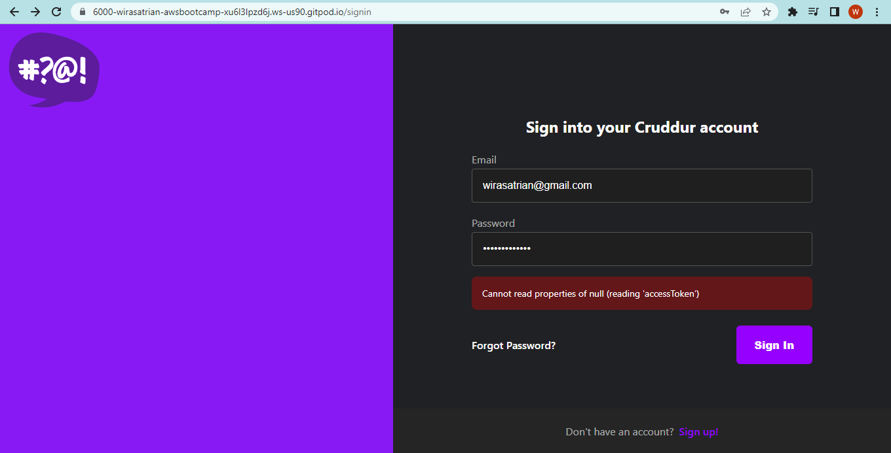

# Week 3 — Decentralized Authentication

**Amazon Cognito** lets you easily add user sign-up and authentication to your mobile and web apps. With Cognito, you can enable your users to sign up, sign in, and manage their user profiles across different platforms and devices.

In this week, I learn to decentralized authentication in the sample application using Amazon Cognito and using Amazon Amplify client-side library. 

Here are the steps i am doing to implement decentralized authentication with Amazon Cognito:
  1. Create a Cognito User Pool using the Amazon Cognito console. A user pool is a user directory in Amazon Cognito. It enables user sign-up, sign-in, and access control.
  2. Configure application to integrate with the user pool using the App integration settings in the Amazon Cognito console:
      - I choose to use email address as attribute that are used to sign-in
      - I choose Cognito default password policy mode, not using Multi-Factor authentication (MFA) and choose email only as delivery method for user account recovery messages.
      - I choose email, name and preferred_username as the required attributes when sign-up
      - I choose to send email with Cognito whne configuring how the user pool send email messages to users.
      - I am not using Cognito hosted UI, however using custom UI for sign-in, sign-up, confirmation and forgot password pages
  3. Implement API calls to Coginto for custom login, sign-up, confirmation and forgot password pages
  4. Use Cognito to authorize user access. When a user signs in, Cognito verifies the user's credentials and returns a JSON Web Token (JWT). I will be verify this JWT to control access to API endpoints in Flask Application.
  

## Create and Configure Cognito User Pool

I login into my AWS account then go to Amazon Cognito console and create User Pool.


## Implement API Calls to Cognito for Custom UI Pages

### Install AWS Amplify Library

```
cd frontend-react-js
npm i aws-amplify --save
```


### Configure Amplify

We need to hook up our cognito pool to our code in the `App.js`


### Conditionally show components based on logged in or logged out

Inside `HomeFeedPage.js` file

```
import { Auth } from 'aws-amplify';

// set a state
const [user, setUser] = React.useState(null);

// check if we are authenicated
const checkAuth = async () => {
  Auth.currentAuthenticatedUser({
    // Optional, By default is false. 
    // If set to true, this call will send a 
    // request to Cognito to get the latest user data
    bypassCache: false 
  })
  .then((user) => {
    console.log('user',user);
    return Auth.currentAuthenticatedUser()
  }).then((cognito_user) => {
      setUser({
        display_name: cognito_user.attributes.name,
        handle: cognito_user.attributes.preferred_username
      })
  })
  .catch((err) => console.log(err));
};

// check when the page loads if we are authenicated
React.useEffect(()=>{
  loadData();
  checkAuth();
}, [])
```

I want to pass user to the following components:

```js
<DesktopNavigation user={user} active={'home'} setPopped={setPopped} />
<DesktopSidebar user={user} />
```

Rewrite `DesktopNavigation.js` file so that it it conditionally shows links in the left hand column on whether you are logged in or not.

```
import './DesktopNavigation.css';
import {ReactComponent as Logo} from './svg/logo.svg';
import DesktopNavigationLink from '../components/DesktopNavigationLink';
import CrudButton from '../components/CrudButton';
import ProfileInfo from '../components/ProfileInfo';

export default function DesktopNavigation(props) {

  let button;
  let profile;
  let notificationsLink;
  let messagesLink;
  let profileLink;
  if (props.user) {
    button = <CrudButton setPopped={props.setPopped} />;
    profile = <ProfileInfo user={props.user} />;
    notificationsLink = <DesktopNavigationLink 
      url="/notifications" 
      name="Notifications" 
      handle="notifications" 
      active={props.active} />;
    messagesLink = <DesktopNavigationLink 
      url="/messages"
      name="Messages"
      handle="messages" 
      active={props.active} />
    profileLink = <DesktopNavigationLink 
      url="/@andrewbrown" 
      name="Profile"
      handle="profile"
      active={props.active} />
  }

  return (
    <nav>
      <Logo className='logo' />
      <DesktopNavigationLink url="/" 
        name="Home"
        handle="home"
        active={props.active} />
      {notificationsLink}
      {messagesLink}
      {profileLink}
      <DesktopNavigationLink url="/#" 
        name="More" 
        handle="more"
        active={props.active} />
      {button}
      {profile}
    </nav>
  );
}
```

Update `ProfileInfo.js` file

```js
import { Auth } from 'aws-amplify';

const signOut = async () => {
  try {
      await Auth.signOut({ global: true });
      window.location.href = "/"
  } catch (error) {
      console.log('error signing out: ', error);
  }
}
```


Rewrite `DesktopSidebar.js` so that it conditionally shows components in case you are logged in or not.

```
import './DesktopSidebar.css';
import Search from '../components/Search';
import TrendingSection from '../components/TrendingsSection'
import SuggestedUsersSection from '../components/SuggestedUsersSection'
import JoinSection from '../components/JoinSection'

export default function DesktopSidebar(props) {
  const trendings = [
    {"hashtag": "100DaysOfCloud", "count": 2053 },
    {"hashtag": "CloudProject", "count": 8253 },
    {"hashtag": "AWS", "count": 9053 },
    {"hashtag": "FreeWillyReboot", "count": 7753 }
  ]

  const users = [
    {"display_name": "Andrew Brown", "handle": "andrewbrown"}
  ]

  let trending;
  if (props.user) {
    trending = <TrendingSection trendings={trendings} />
  }

  let suggested;
  if (props.user) {
    suggested = <SuggestedUsersSection users={users} />
  }
  let join;
  if (props.user) {
  } else {
    join = <JoinSection />
  }

  return (
    <section>
      <Search />
      {trending}
      {suggested}
      {join}
      <footer>
        <a href="#">About</a>
        <a href="#">Terms of Service</a>
        <a href="#">Privacy Policy</a>
      </footer>
    </section>
  );
}
```

### Custom Sign-in Page

In `Signinpage.js' file, add or insert codes as in the green box, and comment/erase the line of codes in the red box as below :


### Custom Sign-Up Page

In `Signuppage.js' file, add or insert codes as in the green box, and comment/erase the line of codes in the red box as below :


### Custom Confirmation Page

In `ConfirmationPage.js' file, add or insert codes as in the green box, and comment/erase the line of codes in the red box as below :


### Custom Forgot Password Page

In `RecoverPage.js' file, add or insert codes as in the green box, and comment/erase the line of codes in the red box as below :


### Run and Test Application

#### Insert Environment Variable in 'docker-compose.yml' file


I right click `docker-compose.yml` file, then select **Compose Up**. I ensure all service are running and make the service port to be public.

### Sign-Up


### Confirmation

After sign-up, I redirect to confirmation page and need to fill confirmation code as received on my email


Then clik on Confirm Email button. When successfull, go to AWS Cognito console to check the user created.


### Sign-In



If sign-in successfull, the home page will display


### Forgot Passsword


Check the recovery code on email :


Do recovery, then will display below when success


